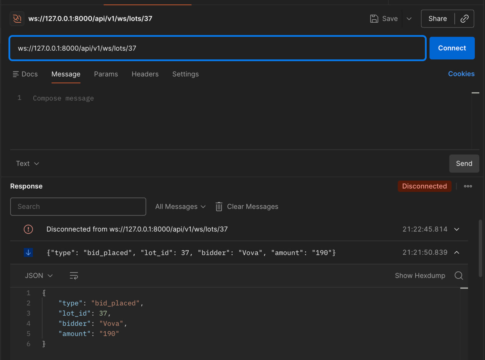

# Auction Service

REST + WebSocket сервіс для проведення онлайн-аукціонів у реальному часі.

## Технології

- **Python 3.12**, **FastAPI**, **SQLAlchemy 2.0** (async), **Alembic**
- **PostgreSQL 17**, **asyncpg**
- **WebSocket** для real-time оновлень
- **Docker**, **Docker Compose**
- **uv** — менеджер пакетів
- **ruff** — лінтер/форматер
- **pytest** + **pytest-asyncio** — тести

## Запуск

### Docker (рекомендовано)

```bash
git clone https://github.com/tigersaymon/fastapi-auction-task.git
cd fastapi-auction-task
docker compose up --build
```

Сервіс буде доступний на `http://localhost:8000`.
Swagger UI: `http://localhost:8000/docs`

> Міграції застосовуються автоматично при старті контейнера.

### Локально (без Docker)

```bash
# 1. Встановити uv (якщо ще не встановлено)
curl -LsSf https://astral.sh/uv/install.sh | sh

# 2. Встановити залежності
uv sync

# 3. Налаштувати змінні середовища
cp .env.sample .env
# Відредагувати .env — вказати свої дані PostgreSQL

# 4. Застосувати міграції
uv run alembic upgrade head

# 5. Запустити сервер
uv run uvicorn src.main:app --reload
```

## API

### REST ендпоінти

| Метод | Шлях | Опис |
|-------|------|------|
| `POST` | `/api/v1/lots` | Створити новий лот |
| `GET` | `/api/v1/lots` | Список активних лотів (з пагінацією) |
| `GET` | `/api/v1/lots/{lot_id}` | Отримати лот за ID |
| `POST` | `/api/v1/lots/{lot_id}/bids` | Зробити ставку |
| `GET` | `/health` | Health check |

### WebSocket

```
ws://localhost:8000/ws/lots/{lot_id}
```

Підключення до WebSocket-каналу конкретного лота. Клієнт отримує повідомлення про нові ставки та завершення аукціону.

#### Формат повідомлень

**Нова ставка:**
```json
{
  "type": "bid_placed",
  "lot_id": 37,
  "bidder": "Vova",
  "amount": "190"
}
```

**Лот завершено:**
```json
{
  "type": "lot_ended",
  "lot_id": 37
}
```

#### Приклад WebSocket-з'єднання (Postman)



## Структура проєкту

```
fastapi-auction-task/
├── .github/workflows/
│   └── ci.yml                  # CI pipeline (lint + test)
├── migrations/                 # Alembic міграції
├── src/
│   ├── bids/
│   │   ├── models.py           # ORM-модель Bid
│   │   ├── repository.py       # Репозиторій для ставок
│   │   └── schemas.py          # Pydantic-схеми ставок
│   ├── core/
│   │   ├── interfaces/
│   │   │   ├── repository.py   # Абстрактний репозиторій
│   │   │   └── uow.py          # Абстрактний Unit of Work
│   │   ├── config.py           # Налаштування (pydantic-settings)
│   │   ├── database.py         # Async engine та session factory
│   │   ├── dependencies.py     # FastAPI DI
│   │   ├── exception_handlers.py
│   │   ├── logging_config.py   # Структурований JSON-логінг
│   │   └── middleware.py       # Request ID middleware
│   ├── lots/
│   │   ├── exceptions.py       # Доменні помилки
│   │   ├── models.py           # ORM-модель Lot
│   │   ├── repository.py       # Репозиторій для лотів
│   │   ├── router.py           # REST ендпоінти (lots + bids)
│   │   ├── schemas.py          # Pydantic-схеми лотів
│   │   └── service.py          # AuctionService (бізнес-логіка)
│   ├── tasks/
│   │   └── scheduler.py        # Автозакриття прострочених лотів
│   ├── ws/
│   │   ├── manager.py          # ConnectionManager (WebSocket)
│   │   └── router.py           # WebSocket ендпоінт
│   └── main.py                 # Точка входу FastAPI
├── tests/
│   ├── conftest.py
│   ├── test_auction_service.py
│   ├── test_ws_manager.py
│   ├── test_scheduler.py
│   └── test_middleware.py
├── .env.sample
├── alembic.ini
├── docker-compose.yml
├── Dockerfile
├── pyproject.toml
└── uv.lock
```

## Архітектурні рішення

**Repository + Unit of Work** — доступ до даних через абстракції, бізнес-логіка не залежить від SQLAlchemy напряму.

**AuctionService** — єдиний сервіс для лотів і ставок, оскільки ставка завжди модифікує лот (ціна, час). Один сервіс = одна транзакція = атомарність.

**Dual locking** — песимістичне блокування (`SELECT ... FOR UPDATE`) при ставці для запобігання race conditions, оптимістичне (`version` column) як додатковий захист.

**Scheduler** — `asyncio.Task` що кожні N секунд закриває прострочені лоти та розсилає `lot_ended` через WebSocket.

## Тести

```bash
# Через uv
uv run pytest tests/ -v

# Або напряму
pytest tests/ -v
```

## Змінні середовища

| Змінна | За замовчуванням | Опис |
|--------|------------------|------|
| `POSTGRES_USER` | `auction` | Користувач БД |
| `POSTGRES_PASSWORD` | `auction` | Пароль БД |
| `POSTGRES_HOST` | `localhost` | Хост БД |
| `POSTGRES_PORT` | `5432` | Порт БД |
| `POSTGRES_DB` | `auction` | Назва БД |
| `DEBUG` | `true` | Режим дебагу |
| `BID_EXTENSION_SECONDS` | `120` | Подовження часу лота при ставці (сек) |
| `BID_EXTENSION_THRESHOLD_SECONDS` | `300` | Поріг для подовження (сек) |
| `SCHEDULER_POLL_SECONDS` | `5` | Інтервал перевірки прострочених лотів |